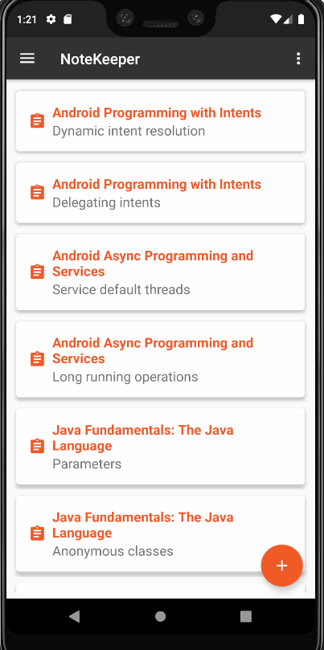

## Android Apps with Kotlin: Custom Views - PluralSight course

#Extending Views

 - create a ColorSlider custom view by extending a SeekBar
 - use Canvas and Paint
 - use custom attributes
 - support different screen sizes

## Screenshots

